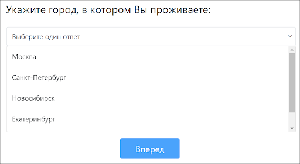
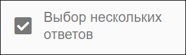
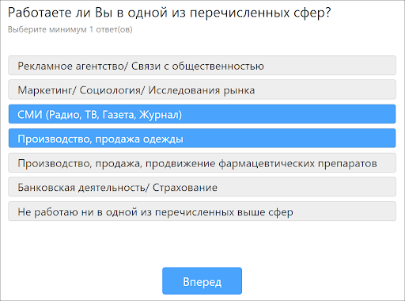
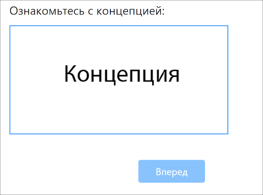

# Доступные типы вопросов
## 1. Выбор одного ответа

Вопрос, в котором респонденту предлагается выбрать один ответ из представленных на экране. Варианты ответов могут содержать изображения.

#### Доступные настройки для каждого варианта ответа:
**Другое** - добавить поле для ввода;
**Заголовок** - вариант ответа в виде текста(заголовка) без возможности выбора;
**Закреплен** - положение варианта ответа будет закреплено и не изменится при ротации.

#### Доступные настройки вопроса:
**Показывать этот вопрос** - возможность задать условие показа вопроса;
**Показать варианты ответов** - возможность задавать условие показа вариантов ответа;
**Ответ НЕ обязателен** - вопрос можно сделать необязательным для ответа;
**Количество колонок на больших экранах** - возможность задать количество колонок на больших экранах;
**Раскрывающиеся заголовки** - визуализация вопроса с раскрывающимися заголовками;
**Автоматический переход** - переход к следующему вопросу после выбора ответа (без нажатия на кнопку Вперед);
**Группа** - возможность включить вопрос в группу;
**Сортировка ответов** - возможность задавать порядок вариантов ответов, например случайный;
**Количество колонок на маленьких экранах** -  возможность задать количество колонок на маленьких экранах;

## 2. Выпадающий список

Вопрос, в котором респонденту предлагается выбрать один ответ из выпадающего списка. Варианты ответов могут содержать изображения.

#### Доступные настройки для каждого варианта ответа:
**Другое** - добавить поле для ввода;
**Заголовок** - вариант ответа в виде текста(заголовка) без возможности выбора;
**Закреплен** - положение варианта ответа будет закреплено и не изменится при ротации.

#### Доступные настройки вопроса:
**Показывать этот вопрос** - возможность задать условие показа вопроса;
**Показать варианты ответов** - возможность задавать условие показа вариантов ответа;
**Ответ НЕ обязателен** - вопрос можно сделать необязательным для ответа;
**Поиск по значениям** - выпадающий список с поиском;
**Группа** - возможность включить вопрос в группу;
**Сортировка ответов** - возможность задавать порядок вариантов ответов, например случайный; 
**Автоматический переход** - переход к следующему вопросу после выбора ответа (без нажатия на кнопку Вперед);

## 3. Выбор нескольких ответов

Вопрос, в котором респонденту предлагается выбрать один ответ из выпадающего списка. Варианты ответов могут содержать изображения.

#### Доступные настройки для каждого варианта ответа:
**Другое** - добавить поле для ввода;
**Заголовок** - вариант ответа в виде текста(заголовка) без возможности выбора;
**Закреплен** - положение варианта ответа будет закреплено и не изменится при ротации;
**Исключающий** - с этой настройкой вариант ответа будет исключать остальные варианты.

#### Доступные настройки вопроса:
**Показывать этот вопрос** - возможность задать условие показа вопроса;
**Показать варианты ответов** - возможность задавать условие показа вариантов ответа;
**Ответ НЕ обязателен** - вопрос можно сделать необязательным для ответа;
**Минимальное число ответов** - возможность задать минимальное количество ответов;
**Количество колонок на больших экранах** - возможность задать количество колонок на больших экранах;
**Раскрывающиеся заголовки** - визуализация вопроса с раскрывающимися заголовками;
**Группа** - возможность включить вопрос в группу;
**Сортировка ответов** - возможность задавать порядок вариантов ответов, например случайный;  
**Максимальное число ответов** - возможность задать максимальное количество ответов;
**Количество колонок на маленьких экранах** - возможность задать количество колонок на маленьких экранах;
**Автоматический переход** - переход к следующему вопросу после выбора ответа (без нажатия на кнопку Вперед);

## 4. Оценка звезды

Вопрос в виде шкалы с изменяемыми шаблонами.
Доступные шаблоны для оценки: Звезды, Сердца, Лайки.
Размер шкалы варьируется от 2 до 11.

Помимо шкалы есть возможность добавить альтернативный вариант ответа, который будет располагаться под шкалой. Альтернативный ответ может быть представлен в виде текстовой формулировки или изображения.

#### Доступные настройки вопроса:
**Показывать этот вопрос** - возможность задать условие показа вопроса;
**Шкала** - доступная визуализация шкалы: Звезды, Сердца, Лайки;
**Размер шкалы** - возможность задать размер шкалы, минимум - 2, максимум - 11;
**Ответ НЕ обязателен** - вопрос можно сделать необязательным для ответа;
**Автоматический переход** - переход к следующему вопросу после выбора ответа (без нажатия на кнопку Вперед);
**Группа** - возможность включить вопрос в группу;
**Цвет шкалы** - возможности задавать цвет шкалы;
**Сортировка альтернативных ответов** - возможность задавать порядок альтернативных вариантов ответов, например случайный;  
**Открыть изображения по клику** - увеличение изображения.

## 5. Оценка бегунок

Ответ в виде шкалы с бегунком, для ответа необходимо передвигать бегунок по шкале.

Помимо шкалы есть возможность добавить подписи на шкале и альтернативный вариант ответа, который будет располагаться под шкалой. Подписи и альтернативный ответ может быть представлен в виде текстовой формулировки или изображения.

#### Доступные настройки вопроса:
**Показывать этот вопрос** - возможность задать условие показа вопроса;
**Начало шкалы** - минимальное значение шкалы;
**Конец шкалы** - максимальное значение шкалы;
**Префикс значения/Постфикс значения(Инпут поля)** - параметры “Префикс значения” и “Постфикс значения” . По умолчанию пустые. Если заданы то показываются, слева и справа от выбранного в качестве ответа значения шкалы над бегунком. Например, если префикс $, и я выбрать ответ 1000, то над бегунком покажется надпись $1000.
**Шаг** - задает шаг шкалы. По умолчанию равен 1.
**Комментарий к ответу** - возможность прокомментировать ответ;
**Начальное значение** - первоначальное положение бегунка на шкале;
**Показывать выбранное значение** - сверху бегунка будет отображаться выбранный ответ;
**Ответ НЕ обязателен** - вопрос можно сделать необязательным для ответа;
**Автоматический переход** - переход к следующему вопросу после выбора ответа (без нажатия на кнопку Вперед);
**Группа** - возможность включить вопрос в группу;
**Порядок шкалы** - возможность задавать порядок шкалы, например в обратном порядке; 
**Открыть изображения по клику** - увеличение изображения.

##  6. Группа

Группообразующий вопрос, может содержать один и более вопросов. 

Используется для ротации вопросов или для отображения двух и более вопросов на одной странице.

#### Доступные настройки вопроса:
**Показывать этот вопрос** - возможность задать условие показа вопроса;
**Сортировка вопросов в группе** - возможность задавать порядок вопросов, например случайный;  
**Открыть изображения по клику** - увеличение изображения;
**На одной странице** - отображать вопросы на одной странице;
**Отображать описание группы** - возможность отображать или нет описание группы на экране.

## 7. Текстовый ответ

Пользователю нужно вписать ответ в текстовое поле

Помимо поля для ввода есть возможность добавить альтернативный вариант ответа, который будет располагаться под полем для ввода. Альтернативный ответ может быть представлен в виде текстовой формулировки или изображения.

#### Доступные настройки вопроса:
**Показывать этот вопрос** - возможность задать условие показа вопроса;
**Группа** - возможность включить вопрос в группу;
**Сортировка альтернативных ответов** - возможность задавать порядок альтернативных вариантов ответов, например случайный; 
**Ответ НЕ обязателен** - вопрос можно сделать необязательным для ответа;
**Минимальное число символов** - возможность задать минимальное количество символов для ввода;
**Максимальное число символов** - возможность задать максимальное количество символов для ввода;
**Открыть изображения по клику** - увеличение изображения;
**Словарь** - возможность загрузить словарь для автокодирования ответов. Словарь добавляется по запросу.

## 8. Таймер

Демонстрация вопроса или любых материалов респонденту на ограниченное количество времени. Например, можно показать упаковку товара на 3 секунды и спросить, что респонденту запомнилось.

При демонстрации концепции кнопка Вперед не кликабельна, после завершения таймера срабатывает автоматический переход к следующему вопросу.

#### Доступные настройки вопроса:
**Показывать этот вопрос** - возможность задать условие показа вопроса;
**Группа** - возможность включить вопрос в группу;
**Ответ НЕ обязателен** - вопрос можно сделать необязательным для ответа;
**Открыть изображения по клику**  - увеличение изображения;
**Время показа (децисек.)** - возможность задать необходимое время показала вопроса.